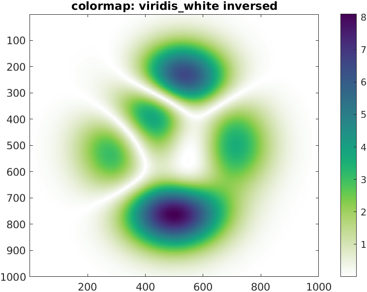

# viridis_white: a modified viridis colormap

## Summary
The viridis_white colormap is a modification of the Viridis colormap that was introduced in Matplotlib in 2015. In viridis_white, the yellowish sequence is replaced by a white sequence. It allows some additional flexibility when it comes to using a colormap on a white background. Note: The viridis_white colormap may exist for Matplotlib too. I saw it some years ago but could not find the webpage anymore. If you find it, please notify me so I can add it in the acknowledgments.

## Content

The present submission contains
  - viridis_white.m: the function that creates the viridis_white colormap
  - viridis.m: the viridis colormap in Matlab  for comparison purpose [1]
  - Documentation.mlx: A Matlab LiveScript that illustrates how th viridis_white colormap looks like can be used 

Any comment, question or suggestion is welcome

## References

[1] Ander Biguri (2021). Perceptually uniform colormaps (https://www.mathworks.com/matlabcentral/fileexchange/51986-perceptually-uniform-colormaps), MATLAB Central File Exchange. Retrieved June 9, 2021. 

## Example

